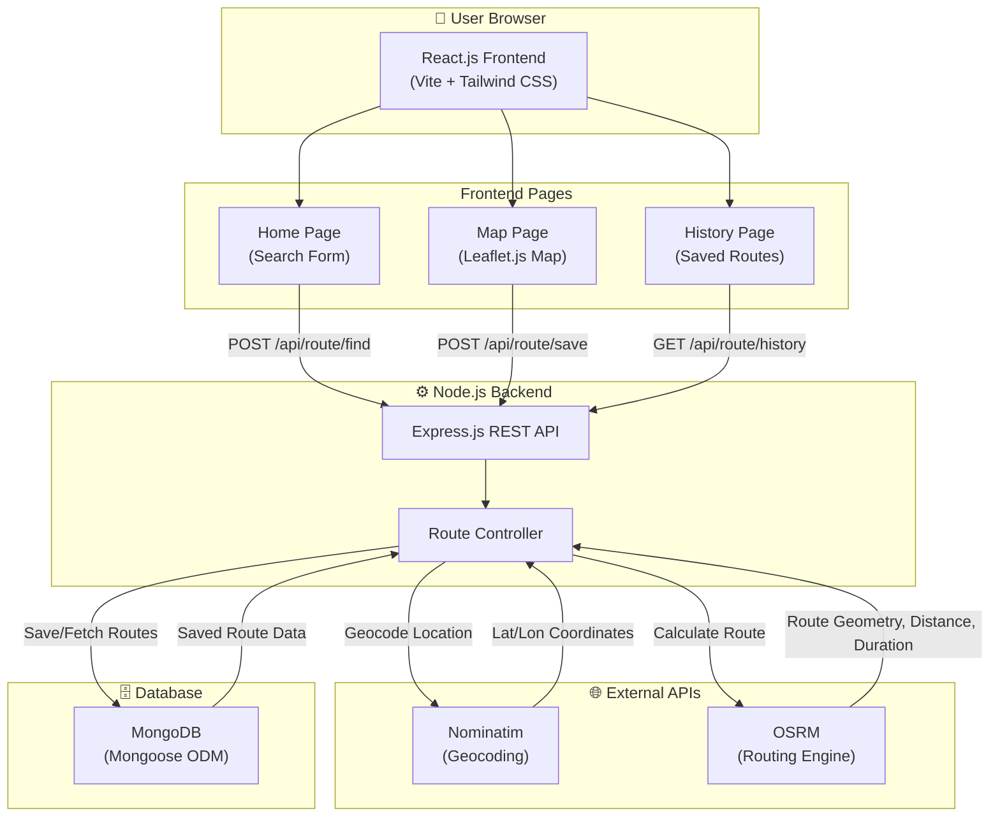

# Sarithra – Smart Route Finder: Expo Documentation

---

## 1. System Architecture Diagram

---

## 2. Project Abstract

### Sarithra – Smart Route Finder

**Introduction:**
Sarithra is a web-based smart route finding application designed to help users discover the best travel route between any two locations. It uses modern web technologies including React.js for the frontend, Node.js with Express.js for the backend, and MongoDB for persistent data storage.

**Problem Statement:**
Travelers and commuters often need a quick and reliable way to find the shortest and most efficient route between two places. While commercial navigation apps exist, they are closed-source and proprietary. Sarithra provides an open, educational alternative that demonstrates how route-finding systems work internally.

**Proposed Solution:**
The system takes a source and destination as text input from the user, geocodes these locations using the OpenStreetMap Nominatim API to obtain GPS coordinates, and then calculates the optimal driving route using the OSRM (Open Source Routing Machine) API. The resulting route is displayed as an interactive polyline on a Leaflet.js map, along with distance (in km) and estimated travel time (in minutes). Users can save their searched routes to a MongoDB database and view their search history later.

**Key Features:**
1. Location search by name with automatic geocoding
2. Interactive map display with route polyline
3. Distance and estimated travel time calculation
4. Route saving and history management
5. Responsive design for mobile and desktop
6. Clean, premium dark-mode user interface

**Technologies Used:**
- Frontend: React.js, Vite, Tailwind CSS, Leaflet.js
- Backend: Node.js, Express.js
- Database: MongoDB with Mongoose
- APIs: OpenStreetMap Nominatim (geocoding), OSRM (routing)

**Conclusion:**
Sarithra demonstrates a practical implementation of a smart route finder using entirely open-source tools and APIs. It serves as an excellent educational project for understanding full-stack web development, REST API design, map integration, and database management.

---

## 3. PPT Content (10–12 Slides)

### Slide 1: Title Slide
- **Title:** Sarithra – Smart Route Finder
- **Subtitle:** A Full-Stack Web Application for Intelligent Route Navigation
- **Team Members:** [Your names here]
- **College & Department:** [Your college details here]
- **Date:** [Presentation date]

### Slide 2: Introduction
- Travel route planning is a daily need for millions
- Traditional methods rely on proprietary tools
- Sarithra provides an open-source, educational alternative
- Built using modern web technologies (React, Node.js, MongoDB)

### Slide 3: Problem Statement
- Users need a quick way to find the best route between two locations
- Lack of transparency in how commercial navigation tools work
- Need for an educational project that demonstrates real-world route-finding algorithms and APIs

### Slide 4: Proposed Solution
- A full-stack web app with search, map, and history features
- Text-based location input with automatic geocoding
- Real-time route calculation using OSRM
- Interactive map rendering using Leaflet.js + OpenStreetMap
- Persistent route history using MongoDB

### Slide 5: System Architecture
- Three-tier architecture: Frontend → Backend → Database
- React.js frontend communicates via REST API
- Express.js backend handles geocoding and routing logic
- MongoDB stores saved routes
- External APIs: Nominatim (geocoding), OSRM (routing)

*(Include the architecture diagram from Section 1)*

### Slide 6: Technology Stack
| Component  | Technology                       |
|------------|----------------------------------|
| Frontend   | React.js, Vite, Tailwind CSS     |
| Maps       | Leaflet.js, OpenStreetMap        |
| Backend    | Node.js, Express.js              |
| Database   | MongoDB, Mongoose                |
| Geocoding  | Nominatim API                    |
| Routing    | OSRM API                         |

### Slide 7: Features Overview
1. 🔍 Search source and destination by place name
2. 🗺️ Interactive map with route polyline display
3. 📏 Distance (km) and estimated duration (minutes)
4. 💾 Save routes to database
5. 📜 View and reload route history
6. 📱 Responsive design for all devices
7. 🎨 Modern dark-mode glassmorphism UI

### Slide 8: Database Design
**User Model:**
- name (String), email (String)

**Route Model:**
- source (String), destination (String)
- sourceCoords ([Number]), destinationCoords ([Number])
- distance (Number), duration (Number)
- geometry (Object – GeoJSON), createdAt (Date)

### Slide 9: API Endpoints
| Method | Endpoint             | Purpose                   |
|--------|----------------------|---------------------------|
| POST   | /api/route/find      | Calculate route            |
| POST   | /api/route/save      | Save route to database     |
| GET    | /api/route/history   | Get saved route history    |

### Slide 10: Screenshots / Demo
*(Include screenshots of:)*
- Home page with search form
- Map page showing a route polyline between two cities
- History page listing saved routes

### Slide 11: Future Enhancements
- User authentication and login
- Multiple route options (fastest, shortest, scenic)
- Voice search integration
- Real-time traffic data
- Turn-by-turn navigation directions
- Route sharing via link

### Slide 12: Conclusion & Thank You
- Successfully built a full-stack smart route finder
- Demonstrates practical use of geocoding, routing APIs, and map rendering
- Clean, beginner-friendly codebase suitable for learning
- **Thank You!** Questions?

---

## 4. Viva Questions & Answers

### Q1: What is Sarithra?
**A:** Sarithra is a full-stack web application that finds the best route between two locations. It uses React.js for the frontend, Node.js with Express.js for the backend, and MongoDB for data storage. The app displays routes on an interactive map using Leaflet.js with OpenStreetMap.

### Q2: What technologies did you use and why?
**A:** We used React.js for a component-based, responsive UI; Tailwind CSS for rapid styling; Leaflet.js for open-source map rendering; Node.js with Express.js for a lightweight REST API; MongoDB for flexible document-based storage; and OSRM/Nominatim as free, open-source APIs for routing and geocoding.

### Q3: How does the routing work?
**A:** When a user enters a source and destination, the backend first geocodes the text locations into latitude/longitude coordinates using the Nominatim API. Then, these coordinates are sent to the OSRM API which calculates the driving route and returns a GeoJSON geometry, total distance, and duration. The frontend renders this geometry as a polyline on the Leaflet map.

### Q4: What is OSRM?
**A:** OSRM stands for Open Source Routing Machine. It is an open-source routing engine that uses OpenStreetMap data to calculate the shortest/fastest route between geographic coordinates. It returns route geometry, distance, and estimated travel time.

### Q5: What is Nominatim?
**A:** Nominatim is a geocoding service provided by OpenStreetMap. It converts place names (like "Mumbai" or "Paris") into geographic coordinates (latitude and longitude) and vice versa. We use it to resolve user text input into mappable coordinates.

### Q6: What is Leaflet.js?
**A:** Leaflet.js is a lightweight, open-source JavaScript library for interactive maps. We use it to render the OpenStreetMap tiles, add markers for source and destination, and draw the route polyline on the map.

### Q7: Explain the database models used.
**A:** We have two models:
- **User**: Stores name and email (for future authentication features).
- **Route**: Stores source, destination, their coordinates, distance (km), duration (minutes), route geometry (GeoJSON), and creation timestamp.

### Q8: What REST APIs does the backend expose?
**A:**
- `POST /api/route/find` – Accepts source and destination text, geocodes them, calculates route via OSRM, and returns the route data.
- `POST /api/route/save` – Accepts route data and saves it to MongoDB.
- `GET /api/route/history` – Returns all previously saved routes sorted by most recent.

### Q9: How is the map rendered?
**A:** The map is rendered using Leaflet.js with OpenStreetMap tiles (dark theme from CartoDB). When a route is calculated, we create a polyline from the OSRM GeoJSON coordinates and fit the map bounds to show the entire route. Green and red markers indicate source and destination.

### Q10: What is the difference between geocoding and routing?
**A:** Geocoding is converting a place name (text) into GPS coordinates (latitude/longitude). Routing is calculating the best path (with distance and time) between two sets of GPS coordinates along road networks.

### Q11: How do you handle errors?
**A:** The backend returns appropriate HTTP status codes (400 for bad requests, 404 for locations not found, 500 for server errors) with descriptive error messages. The frontend displays these error messages to the user in styled alert boxes.

### Q12: What are the future enhancements possible?
**A:** Future enhancements include user authentication, multiple route options (fastest vs shortest), real-time traffic integration, voice-based search, turn-by-turn navigation directions, and route sharing via shareable links.

### Q13: Why MongoDB instead of SQL?
**A:** MongoDB's flexible, schema-less document model fits well for storing variable route data (especially the GeoJSON geometry object). It's also easy to set up, scales well, and integrates naturally with Node.js through Mongoose.

### Q14: What is GeoJSON?
**A:** GeoJSON is a standard format for encoding geographic data structures. OSRM returns route geometry as a GeoJSON LineString — an array of [longitude, latitude] coordinate pairs that represent the path of the route on a map.

### Q15: How is the project structured?
**A:** The project follows a clean separation of concerns with a `frontend/` directory for the React app and a `backend/` directory for the Express API. The backend is further organized into `config/` (database), `models/` (Mongoose schemas), `controllers/` (business logic), and `routes/` (API endpoints).
